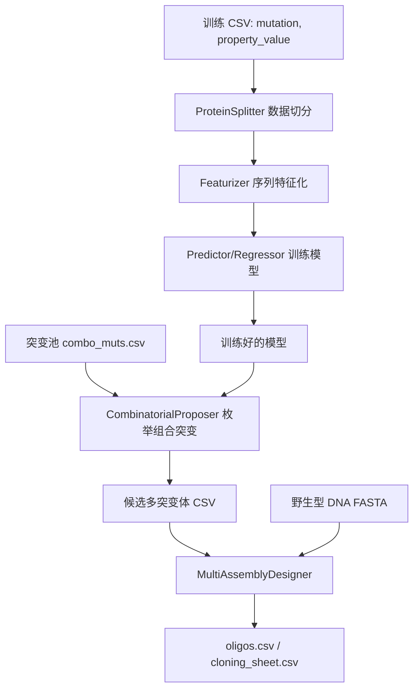

# MULTI-evolve 中文代码阅读指南

本文档面向编程新手，用来阅读论文对应仓库 `VincentQTran/MULTI-evolve`。原始源码没有被修改；中文注释版源码副本在 `annotated_zh/`，其中每个 `.py` 文件顶部、主要类和函数前都加了中文解释。

## 先看结论

这个项目做的是一个蛋白工程流程：

1. 输入已有突变实验数据，也就是突变名和实验测量值。
2. 把蛋白序列或突变转换成机器学习特征。
3. 用回归模型，尤其是 PyTorch 全连接神经网络，学习“序列/突变 -> 性能值”的映射。
4. 枚举或搜索多点组合突变，用训练好的模型打分。
5. 把候选多突变体转换成 MULTI-assembly 实验需要的寡核苷酸设计表。
6. 在某些轮次中，用 ESM、ESM-IF 等蛋白语言模型做 zero-shot 单点突变提名。

最重要的源码主线是：

```text
scripts/p1_train.py
  -> splitters/base_splitters.py
  -> featurizers/base_featurizers.py
  -> predictors/neural_net_regressors.py

scripts/p2_propose.py
  -> predictors/neural_net_regressors.py
  -> proposers/base_proposers.py

scripts/p3_assembly_design.py
  -> utils/cloning_utils.py

scripts/plm_zeroshot_ensemble.py
  -> utils/zeroshot_utils.py
  -> featurizers/zeroshot_featurizers.py
```

## 项目整体架构

`scripts/` 是命令行入口，适合从使用流程理解项目。

`app.py` 是 Streamlit 网页入口，把命令行流程包装成网页表单。

`multievolve/splitters/` 负责把数据分成训练集、验证集和测试集。

`multievolve/featurizers/` 负责把蛋白序列、突变或语言模型分数变成数值矩阵。

`multievolve/predictors/` 负责训练模型并预测突变体性能。

`multievolve/proposers/` 负责生成候选突变体并用模型排序。

`multievolve/utils/` 放共享工具，例如突变格式转换、缓存、zero-shot 打分、克隆设计。

`data/` 放示例数据。

`notebooks/` 放教程和基准实验。

## 建议阅读流程

### 第 0 步：先不要从大模型代码开始

新手很容易一上来打开 `esm_featurizers.py` 或 `zeroshot_utils.py`，然后被 ESM、ESM-IF、torch-geometric、结构文件处理绕进去。建议先从最小主线读起：one-hot 特征 + 全连接网络 + 组合突变提议。

### 第 1 步：读命令行三步流程

先看：

1. `scripts/p1_train.py`
2. `scripts/p2_propose.py`
3. `scripts/p3_assembly_design.py`

这三个文件短，而且反映论文代码的主流程。

你需要理解这些对象：

- `KFoldProteinSplitter`：把数据做 K 折切分。
- `OneHotFeaturizer`：把蛋白序列编码成 one-hot。
- `Fcn`：PyTorch 全连接神经网络。
- `CombinatorialProposer`：枚举组合突变并让模型评分。
- `MultiAssemblyDesigner`：把突变设计成实验用寡核苷酸。

### 第 2 步：读数据格式和切分

看：

1. `multievolve/utils/data_utils.py`
2. `multievolve/splitters/base_splitters.py`

先掌握突变格式：

```text
A40P/E61Y
```

意思是第 40 位 A 变成 P，第 61 位 E 变成 Y。

多链蛋白用冒号分链：

```text
A40P/E61Y:WT
```

### 第 3 步：读基础特征化器

看：

1. `multievolve/featurizers/base_featurizers.py`
2. `multievolve/utils/featurizer_utils.py`
3. `multievolve/featurizers/combinatorial_featurizers.py`

先理解 `BaseFeaturizer.featurize()` 的套路：

```text
输入序列列表
  -> 查缓存
  -> 对没算过的序列调用 custom_featurizer()
  -> 更新缓存
  -> 返回 numpy/torch 可用的数值特征
```

### 第 4 步：读模型训练

看：

1. `multievolve/predictors/base_regressors.py`
2. `multievolve/predictors/neural_net_regressors.py`

`BaseRegressor` 是传统模型基类，`BaseNN` 是 PyTorch 神经网络基类。论文主流程的训练脚本默认使用 `Fcn`。

### 第 5 步：读突变提议

看：

1. `multievolve/proposers/base_proposers.py`
2. `scripts/p2_propose.py`

这里的关键思想是：先准备突变池，再生成组合突变，再用一组训练好的模型预测每个候选的分数，最后按平均分排序。

### 第 6 步：读 zero-shot 蛋白语言模型

看：

1. `scripts/plm_zeroshot_ensemble.py`
2. `multievolve/utils/zeroshot_utils.py`
3. `multievolve/featurizers/zeroshot_featurizers.py`
4. `multievolve/featurizers/esm_featurizers.py`
5. `multievolve/featurizers/msa_featurizers.py`

这一块依赖最多，建议最后读。核心不是训练模型，而是直接用预训练蛋白语言模型给突变打分。

## 主流程详解

### 训练阶段：`p1_train.py`

`p1_train.py` 做这些事：

1. 解析命令行参数，包括实验名、蛋白名、野生型 FASTA、训练数据、WandB key 和运行模式。
2. 登录 WandB。
3. 用 `KFoldProteinSplitter` 生成 5 折数据切分。
4. 用 `OneHotFeaturizer` 生成序列特征。
5. 指定模型列表为 `[Fcn]`。
6. 根据 `test` 或 `standard` 模式选择 sweep 配置。
7. 调用 `run_nn_model_experiments()` 训练神经网络。

新手可以把它理解成一个训练流水线脚本，不需要在这里纠结神经网络细节。

### 提议突变阶段：`p2_propose.py`

`p2_propose.py` 做这些事：

1. 从 WandB 读取前一步所有训练运行。
2. 按测试损失排名，选出最好的超参数组合。
3. 用最佳超参数重新训练 10 个交叉验证模型。
4. 初始化 `CombinatorialProposer`。
5. 对突变池中的多点组合进行预测。
6. 按突变负载，也就是 3 个突变、4 个突变等，挑选每组分数最高的候选。
7. 导出 CSV 文件。

这里最值得读的是“如何从训练结果中选最佳模型结构”和“如何用多个模型平均预测”。

### 寡核苷酸设计阶段：`p3_assembly_design.py`

`p3_assembly_design.py` 很薄，真正工作在 `MultiAssemblyDesigner`。

它做这些事：

1. 读取候选突变 CSV。
2. 读取带 overhang 的野生型 DNA FASTA。
3. 根据物种选择密码子表。
4. 根据突变设计寡核苷酸。
5. 导出 `cloning_sheet.csv` 和 `oligos.csv`。

### zero-shot 阶段：`plm_zeroshot_ensemble.py`

这个脚本不训练模型，而是直接用预训练模型打分：

1. `zero_shot_esm_dms()` 枚举所有单点突变，并用 ESM 打分。
2. `zero_shot_esm_if_dms()` 用结构文件和 ESM-IF 打分。
3. 分别按原始 fold-change 分数和 z-score 策略抽样。
4. 合并 ESM、ESM-IF、ESM-z、ESM-IF-z 四类提名。
5. 输出 `plm_zeroshot_ensemble_nominated_mutations.csv`。

## 关键概念速查

`mutation`：突变字符串，例如 `A40P`。

`mutational load`：一个变体含有多少个单点突变，例如 `A40P/E61Y` 的 load 是 2。

`wild type`：野生型蛋白序列。

`featurizer`：把序列变成数字矩阵的组件。

`splitter`：把数据分成训练、验证和测试的组件。

`predictor/regressor`：预测突变性能的模型。

`proposer`：生成候选突变并排序的组件。

`zero-shot`：不针对当前实验数据训练，直接用预训练语言模型估计突变好坏。

`WandB`：Weights & Biases，用于记录训练运行、指标和超参数。

## 每个文件的作用

### 根目录

| 文件 | 作用 |
|---|---|
| `README.md` | 官方英文说明，包含安装、主流程、命令行和网页用法。 |
| `CODE_READING_GUIDE_ZH.md` | 当前中文阅读指南。 |
| `setup.py` | Python 包安装配置，声明 `multievolve` 包、依赖和命令行脚本。 |
| `pyproject.toml` | 构建系统配置，告诉 pip/setuptools 如何构建项目。 |
| `env.yml` | Linux/ CUDA 推荐 conda 环境，Python 3.11、PyTorch 2.6.0。 |
| `env_mac.yml` | Mac ARM 推荐 conda 环境，PyTorch 2.2.2 CPU。 |
| `MANIFEST.in` | 打包时包含额外资源文件的规则。 |
| `LICENSE` | Apache 2.0 许可证。 |
| `app.py` | Streamlit 网页应用入口。 |

### `.streamlit`

| 文件 | 作用 |
|---|---|
| `.streamlit/config.toml` | Streamlit 网页应用配置，例如主题和服务器选项。 |

### `scripts`

| 文件 | 作用 |
|---|---|
| `scripts/README.md` | 官方命令行流程说明。 |
| `scripts/p1_train.py` | 第 1 步：训练神经网络模型。 |
| `scripts/p2_propose.py` | 第 2 步：选择最佳模型并提议组合突变体。 |
| `scripts/p3_assembly_design.py` | 第 3 步：根据候选突变设计 MULTI-assembly 寡核苷酸。 |
| `scripts/plm_zeroshot_ensemble.py` | 蛋白语言模型 zero-shot 集成提名脚本。 |

### `multievolve`

| 文件 | 作用 |
|---|---|
| `multievolve/__init__.py` | 统一导出子模块对象，方便 `from multievolve import ...`。 |
| `multievolve/multievolve_workflow.png` | README 中展示的流程图。 |
| `multievolve/streamlit_1.png` | README 中展示的网页界面截图。 |

### `multievolve/featurizers`

| 文件 | 作用 |
|---|---|
| `multievolve/featurizers/__init__.py` | 导出所有特征化器。 |
| `multievolve/featurizers/base_featurizers.py` | 基础特征化器，包含 `BaseFeaturizer`、`OneHotFeaturizer`、`GeorgievFeaturizer`、`AAIdxFeaturizer`。 |
| `multievolve/featurizers/combinatorial_featurizers.py` | 组合特征化器，把 one-hot 和 ESM/MSA/AAIndex 等特征合并。 |
| `multievolve/featurizers/esm_featurizers.py` | ESM/ESM Forge 特征提取。 |
| `multievolve/featurizers/msa_featurizers.py` | MSA Transformer 特征提取。 |
| `multievolve/featurizers/zeroshot_featurizers.py` | 把 zero-shot 分数作为特征。 |
| `multievolve/featurizers/ankh_featurizers.py` | Ankh 蛋白语言模型 embedding。 |
| `multievolve/featurizers/prott5_featurizers.py` | ProtT5 embedding。 |
| `multievolve/featurizers/unirep_featurizers.py` | UniRep embedding。 |
| `multievolve/featurizers/model_choices.py` | 特征名称到模型列表的映射。 |
| `multievolve/featurizers/model_locations.py` | 预训练模型名称和位置配置。 |

### `multievolve/predictors`

| 文件 | 作用 |
|---|---|
| `multievolve/predictors/__init__.py` | 导出预测器类。 |
| `multievolve/predictors/base_regressors.py` | 传统机器学习回归器基类和线性、随机森林、Ridge 等模型。 |
| `multievolve/predictors/gaussian_process_regressors.py` | 高斯过程回归器，包括普通 GP、稀疏 GP、线性核、二次核、RBF 核。 |
| `multievolve/predictors/neural_net_regressors.py` | PyTorch 神经网络训练、WandB sweep、`Fcn` 和 `Cnn`。 |

### `multievolve/predictors/sweep_configs`

| 文件 | 作用 |
|---|---|
| `cnn_custom_grid_sweep.yaml` | CNN 自定义网格搜索配置。 |
| `cnn_standard_bayes_sweep.yaml` | CNN 标准贝叶斯搜索配置。 |
| `cnn_standard_grid_sweep.yaml` | CNN 标准网格搜索配置。 |
| `cnn_test_sweep.yaml` | CNN 快速测试搜索配置。 |
| `fcn_custom_grid_sweep.yaml` | 全连接网络自定义网格搜索配置。 |
| `fcn_standard_bayes_sweep.yaml` | 全连接网络标准贝叶斯搜索配置。 |
| `fcn_standard_grid_sweep.yaml` | 全连接网络标准网格搜索配置。 |
| `fcn_test_sweep.yaml` | 全连接网络快速测试搜索配置。 |

### `multievolve/proposers`

| 文件 | 作用 |
|---|---|
| `multievolve/proposers/__init__.py` | 导出突变提议器。 |
| `multievolve/proposers/base_proposers.py` | 所有候选突变生成策略，包括丙氨酸扫描、深度突变扫描、随机突变、组合突变、模型引导搜索和模拟退火。 |

### `multievolve/splitters`

| 文件 | 作用 |
|---|---|
| `multievolve/splitters/__init__.py` | 导出切分器。 |
| `multievolve/splitters/base_splitters.py` | 数据切分核心，包括随机、K 折、按轮次、按位置、按区域、按性质、按突变负载和按结构距离切分。 |

### `multievolve/utils`

| 文件 | 作用 |
|---|---|
| `multievolve/utils/__init__.py` | 导出工具函数。 |
| `multievolve/utils/benchmark_utils.py` | 基准实验工具和训练缓存。 |
| `multievolve/utils/cache_utils.py` | 特征缓存读写。 |
| `multievolve/utils/cloning_utils.py` | MULTI-assembly 寡核苷酸设计、adapter 修剪、CDS 突变分析。 |
| `multievolve/utils/data_utils.py` | 突变格式转换、突变序列生成、Levenshtein 距离、PyTorch 数据集包装。 |
| `multievolve/utils/featurizer_utils.py` | Georgiev/AAIndex 编码和 FASTA/MSA 读取工具。 |
| `multievolve/utils/other_utils.py` | 通用工具：性能指标、WandB 记录、突变池、日志、MSA 辅助。 |
| `multievolve/utils/zeroshot_utils.py` | ESM、MSA Transformer、ESM-IF zero-shot 打分底层实现。 |
| `multievolve/utils/pca-19.npy` | AAIndex/PCA 特征需要的数值数据文件。 |

### `data`

| 文件 | 作用 |
|---|---|
| `data/README.md` | 示例数据说明。 |
| `data/benchmark/README.md` | benchmark 数据说明。 |
| `data/benchmark/dataset_summary.csv` | benchmark 数据集汇总表。 |
| `data/example_protein/apex.fasta` | 示例蛋白 APEX 的氨基酸序列。 |
| `data/example_protein/apex.cif` | 示例蛋白结构文件。 |
| `data/example_protein/APEX_33overhang.fasta` | 含 33 bp overhang 的 APEX DNA 序列，用于寡核苷酸设计。 |
| `data/example_protein/example_dataset.csv` | 示例训练数据，包含突变和性质值。 |
| `data/example_protein/combo_muts.csv` | 示例可组合突变池。 |
| `data/example_protein/MULTI-assembly_input.csv` | MULTI-assembly 输入格式示例。 |
| `data/example_multichain_protein/vh_chain1.fasta` | 多链蛋白示例第 1 条链。 |
| `data/example_multichain_protein/vl_chain2.fasta` | 多链蛋白示例第 2 条链。 |
| `data/example_multichain_protein/multichain_protein.cif` | 多链蛋白结构示例。 |
| `data/example_multichain_protein/example_dataset.csv` | 多链蛋白训练数据示例。 |
| `data/example_multichain_protein/combo_muts.csv` | 多链蛋白组合突变池示例。 |

### `notebooks`

| 文件 | 作用 |
|---|---|
| `notebooks/benchmark/README.md` | benchmark notebook 说明。 |
| `notebooks/benchmark/multievolve_hyperparameter_tuning.py` | 批量超参数调优脚本。 |
| `notebooks/examples/Part_1_introduction.ipynb` | 入门教程，演示基础对象和流程。 |
| `notebooks/examples/Part_2_comparing_multiple_models.ipynb` | 比较不同模型、特征和切分方法的教程。 |
| `notebooks/examples/featurizers.ipynb` | 特征化器示例。 |
| `notebooks/examples/splitters.ipynb` | 数据切分器示例。 |
| `notebooks/examples/zeroshot.ipynb` | zero-shot ESM/ESM-IF 示例。 |

### `annotated_zh`

| 文件 | 作用 |
|---|---|
| `annotated_zh/README_ANNOTATED_ZH.md` | 中文注释版源码副本说明。 |
| `annotated_zh/**/*.py` | 与原始 `.py` 一一对应的中文注释版副本，便于阅读，不建议作为论文复现实验的运行入口。 |

## 关键类阅读地图

### 特征化器

`BaseFeaturizer` 是最值得先读的类。它让所有特征化器共享同一套流程：设置参数、读取缓存、计算缺失特征、更新缓存、返回结果。

`OneHotFeaturizer` 是最简单也最重要的实现。论文命令行主流程默认使用它。

`ESMBaseFeaturizer`、`MSABaseFeaturizer`、`ZeroshotBaseFeaturizer` 属于高级特征化器基类，等理解 one-hot 后再读。

### 切分器

`ProteinSplitter` 是父类，负责把原始 CSV 变成模型能用的数据框。

`KFoldProteinSplitter` 是主流程使用的切分器。它会把数据分成多个 fold，用来评估模型稳定性。

其他切分器用于 benchmark，例如测试模型能否外推到未见位置、未见区域或不同突变负载。

### 预测器

`BaseRegressor` 是 scikit-learn 模型父类。

`BaseNN` 是 PyTorch 模型父类，比较长，但结构可以按以下顺序读：

1. 初始化参数。
2. 准备 DataLoader。
3. 训练循环。
4. 验证和测试。
5. 记录 WandB。
6. 保存模型。

`Fcn` 是全连接网络。它的网络结构很直观：

```text
Flatten
  -> Linear
  -> LeakyReLU
  -> Dropout
  -> 若干隐藏层
  -> Linear 输出 1 个预测值
```

`Cnn` 把序列编码看成二维矩阵，用 `Conv2d` 抽局部模式。

### 突变提议器

`BaseProposer` 统一管理候选序列、预测分数和保存结果。

`CombinatorialProposer` 是主流程关键类。它用突变池枚举组合突变，并用模型打分排序。

`SimulatedAnnealingProposer` 是更偏搜索算法的类，可以等主流程读完再看。

### 克隆设计

`MultiAssemblyDesigner` 很长，但可以按“突变到寡核苷酸”的流程读：

1. 整理突变。
2. 找到氨基酸突变对应的密码子变化。
3. 生成突变 DNA 序列片段。
4. 根据 Tm、方向和 overhang 设计寡核苷酸。
5. 导出实验表格。

## 数据流图



## 新手阅读时的注意点

这个项目大量使用 `from multievolve.xxx import *`。这对新手不友好，因为你看不到名字来自哪里。读代码时可以先查对应子包的 `__init__.py`，再定位具体文件。

很多类继承父类后只重写一个小方法，例如 `custom_featurizer()` 或 `custom_predictor()`。这是一种模板方法模式：父类管流程，子类管细节。

缓存目录通常在 `proteins/<protein_name>/...` 下自动生成。读代码时看到 `use_cache=True` 不要慌，它只是避免重复计算特征或模型。

WandB 是训练流程的重要外部服务。`p2_propose.py` 依赖 WandB 上的训练结果来选最佳架构，所以如果只本地运行一部分代码，可能会卡在 WandB API。

ESM 和 ESM-IF 相关代码会下载或加载很大的预训练模型，也可能需要 GPU。先读结构，不要一上来运行。

## 推荐调试顺序

如果要自己动手跑，建议按这个顺序：

1. 创建 conda 环境并 `pip install -e .`。
2. 先运行 `scripts/p3_assembly_design.py`，它不需要训练模型，依赖相对少。
3. 再读 `data/example_protein/example_dataset.csv` 和 `combo_muts.csv`。
4. 有 WandB key 后再运行 `scripts/p1_train.py --mode test`。
5. 训练成功后再运行 `scripts/p2_propose.py`。
6. 最后再尝试 `scripts/plm_zeroshot_ensemble.py`。

## 中文注释版如何使用

中文注释版在：

```text
annotated_zh/
```

它不是原始论文代码，而是阅读副本。建议这样用：

1. 在原始目录看 `scripts/p1_train.py` 理解流程。
2. 到 `annotated_zh/scripts/p1_train.py` 看中文注释。
3. 回到原始文件核对真实实现。
4. 读大文件时优先看类和函数前的中文注释，再深入函数体。

## 最小阅读路线

如果只想花 1 小时理解项目，可以只读：

1. `scripts/p1_train.py`
2. `scripts/p2_propose.py`
3. `multievolve/featurizers/base_featurizers.py`
4. `multievolve/predictors/neural_net_regressors.py` 中的 `Fcn`
5. `multievolve/proposers/base_proposers.py` 中的 `CombinatorialProposer`

如果想理解论文中的 zero-shot 单点突变提名，再读：

1. `scripts/plm_zeroshot_ensemble.py`
2. `multievolve/utils/zeroshot_utils.py`

如果想理解实验落地设计，再读：

1. `scripts/p3_assembly_design.py`
2. `multievolve/utils/cloning_utils.py` 中的 `MultiAssemblyDesigner`

